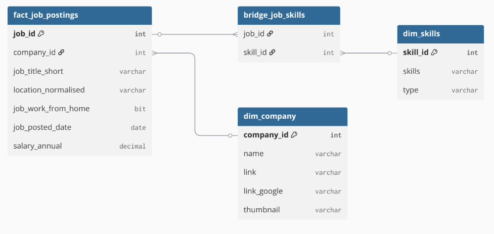

# Job Market Data Analysis (SQL Project)

> A SQL-based analysis of job market trends, focusing on skill demand, salary insights, and remote work adoption.
## 📊 Overview

This project analyzes job posting data to uncover key trends in the data job market.  
The focus is on identifying in-demand skills, understanding salary distributions, evaluating remote work adoption, and analyzing company hiring patterns.

The project follows a structured data pipeline:
- Data cleaning and transformation using Power Query
- Data modeling and analysis using SQL Server
- Visualization of relationships through a star schema design
## ⚙️ Data Pipeline

The data pipeline for this project follows these stages:

Excel Dataset → Power Query (Data Cleaning) → SQL Server (Data Modeling) → SQL Analysis
## 🧱 Data Model

The project uses a star schema design to organize the data efficiently.

- `fact_job_postings` serves as the central table  
- `dim_company` and `dim_skills` provide descriptive attributes  
- `bridge_job_skills` handles the many-to-many relationship between jobs and skills  




## 🛠️ Tools Used

- SQL Server  
- Power Query (Excel)  
- Git & GitHub


---

# 🔥 Optional Upgrade (Looks Even Better)

If you want syntax highlighting (cleaner look):

```md
## 📁 Project Structure

job_market_analysis/
│
├── 01_data/
├── 02_sql/
│   ├── setup/
│   ├── analysis/
│
├── 03_docs/
│   ├── data_cleaning.md
│   ├── data_model.md
│   ├── analysis_breakdown.md
│
├── README.md

```
## ▶️ How to Run This Project

1. Clone the repository:
   
   git clone https://github.com/yourusername/job-market-analysis-sql.git


---

# 🎯 STEP 9: Key Takeaways

```md id="r9"
## 🚀 Key Takeaways

- Core technical skills such as SQL and Python dominate job demand  
- Salary levels vary significantly across different data roles  
- Remote work adoption is not uniform across job categories  
- Certain skills provide both high demand and strong earning potential  

This project demonstrates how structured data analysis can uncover meaningful insights from real-world job market data.
